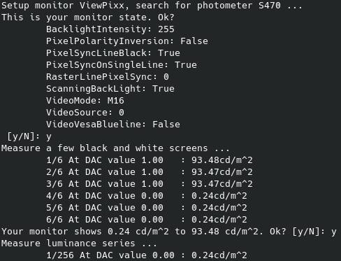
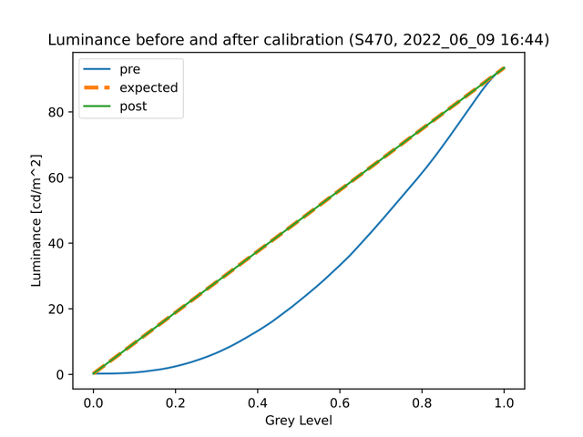
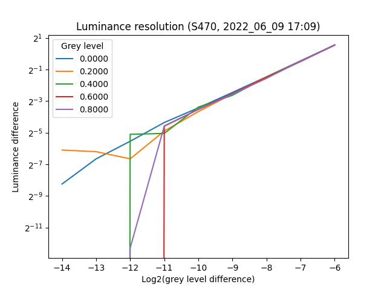

# Psychopy-Pixx

[](https://pypi.python.org/pypi/psychopy-pixx)

Python 3 toolbox for psychophysical experiments with high luminance resolution in the Wichmann Lab.
This toolbox provides utilities for high-resolution gamma linearization (LUT-based) and Psychopy interfaces for ViewPixx and ResponsePixx devices (VPixx Technologies).

Typical monitors support 256 different luminance levels (8-bit), but the human visual system can discriminate many more. 
In psychophysical experiments, we use special monitors like the ViewPixx with several thousand grey levels. 
This high-bit luminance mode requires features currently not included in Psychopy, e.g. proprietary device communication, rearranged graphics output, and 16-bit luminance linearization.

## Installation

The easiest way to install *psychopy-pixx* is the Psychopy Plugin Manager (from Psychopy v2023.1.0). 
In Psychopy, click on `Tools > Plugins`, search *psychopy-pixx*, and click `install`. 

Afterwards, assure that `pypixxlib`, a proprietary library that comes with your VPixx Technology devices is installed to the same python environment (see below).

## Manual setup

If you prefer setting up *psychopy-pixx* without the plugin manager, you can install `psychopy-pixx` as a python package yourself.
In addition, some proprietary software for VPixx Technology devices require a manual installation.

1. Install psychopy
2. Install and start the VPixx system service (proprietary software by VPixx Technologies).
    
    This is system dependend, please ask your sys admin. Some systems start the service automatically, but in our lab the user calls `set-psychopy-mode` (a custom command) after every login. You can find this utility script in [utils](https://github.com/wichmann-lab/psychopy-pixx/tree/main/utils).
3. Install [pypixxlib](https://www.vpixx.com/manuals/python/html/gettingStartd.html) (proprietary software by VPixx Technologies; tested with version 3.11) in the environment. `pypixxlib.tar.gz` is bundled with the other VPixx software and should be available to every VPixx customer.

    `pip3 install -U  PATH_TO_FILE/VPixx\ Software\ Tools/Software\ Tools/pypixxlib/pypixxlib.tar.gz`
4. Install this toolbox and the remaining dependencies with pip in the environment.

    `pip3 install psychopy-pixx`

## Calibration

The default calibration tools of psychopy do not enable us to take advantage of the ViewPixx monitor's high luminance. Our calibration tools provide the following features: 

* Measure luminances in ViewPixx's high-luminance resolution mode (*M16*)
* Store measurements and monitor state with Psychopy's monitor tool. 
* Linearize luminances with interpolation instead of Gamma-functions, because (our ViewPixx's) measurements do not follow a power function. 
* 16-bit CLUT in the rendering shader w/o changing the ViewPixx's hardware CLUT. 

### Configure the monitor
Our tools use Psychopy's monitor management to store the calibration. 
First, create and configure (resolution, etc.) the monitor in the [Monitor Center](https://psychopy.readthedocs.io/en/latest/general/monitors.html). 
Then set the ViewPixx monitor's registers with the VPixx command-line tool *VPutil*, i.e. enable high-luminance resolution mode *M16*, enable/disable scanning backlight, or adjust backlight intensity.

### Measure the luminances

Set up your monitor and direct the photometer to the centre of the monitor. 
The calibration uses the command-line program `pixxcalibrate`, which first asks you to confirm the ViewPixx settings, then measures luminances pre- and post-linearization, and the plots and stores these measurements.
In addition, the command measures and plots small luminance differences to test the monitor's luminance resolution.

#### Getting started
Try `pixxcalibrate` with these settings for a quick measurement, showing how it works.

```sh
pixxcalibrate -m ViewPixx -s 1 -p S470 --measures 5 --levels 256 --levelspost 128 --restests 3 --plot
```



#### Full measurement

Use more measurements per grey level and especially grey levels for an extensive calibration, which takes several hours.
```sh
pixxcalibrate -m ViewPixx -s 1 -p S470 --measures 250 --levels 4096 --levelspost 2056 --restests 10 --plot --random
```

The measurements and metadata (monitor state and photometer settings) are stored as a new calibration in the psychopy monitor management centre. 

### Interpreting the resulting plots

#### Luminance linearity
The first plot shows luminance per grey level. Before calibration, the luminance should increase exponentially and is typically described by a power- or gamma-function. Note that our Viewpixx' luminance here saturates and doesn't *strictly* follow a power function.
For this reason, we linearize the luminance with a linear-interpolation approach instead of fitting a power function (Psychopy's approach). 
The second measurement, after linearization, shows a linear relation between grey level and luminance.



#### Luminance resolution
Besides luminance linearity, we are also interested in the luminance resolution--the minimal grey level difference that the monitor can show. A standard monitor uses 8-bit pixel data and can show up to 256 different shades of grey (we call this "8-bit resolution")
Lab monitors like the Viewpixx in high luminance-resolution mode (*M16*) can show up to $2^12$ different shades of grey, depending on monitor specs ("10-bit resolution" / "12-bit resolution"). We can verify these specs by measuring tiny increments in luminance, assuming that our photometer is accurate enough. 

The figure shows such a measurement for our monitor. The minimal luminance increment depends on the absolute brightness but is about 11-bit (about 2.000 grey levels). For every line, we picked a base-level $x_0$ and added tiny but increasing differences, $x_i = x_0 + 2^{-i}$. Then we measured the base luminance $lum(x_0)$ and luminances $lum(x_{14})$ to $lum(x_6)$, as most monitors are in the range of 8 to 12 bit. The plot shows the change in luminance $lum(x_i) - lum(x_0)$ for each grey level difference $i$. If the luminance was linearized, the luminance by the level plot shows a line; the x-position where this line drops to zero indicates our luminance resolution.




## Devices
The following classes extend psychopy to access VPixx Technologies' ViewPixx monitor and ResponsePixx button-boxes.
Short examples show how to get started in Psychopy's **Coder** and **Builder** with [Code Components](https://www.psychopy.org/builder/components/code.html). 

### ViewPixx Monitor

The ViewPixx class patches Psychopy's window rendering for the ViewPixx high luminance-resolution video modes and simplifies hardware interaction. Supported video modes are:

* `mode='C24'`:  8-bit color mode (default).
* `mode='M16': 16-bit grayscale mode (merges red and green input channels).
* `mode='C48'`: 16-bit color mode (merges two input pixels).

The high-bit modes require high-resolution luminance linearization, not provided by Psychopy.
First, disable Psychopy's gamma-linearization (`Window(gamma=1)`),  then use our interpolation-based linearization. The linearization requires the luminance measurements from the monitor's current calibration file. Additionally, our linearization function asserts that the monitor's current state equals the state during calibration and throws an error otherwise. 

```python
# Before Experiment
from psychopy import visual
from psychoy_pixx.devices import ViewPixx

## Begin Experiment
win = visual.Window(..., useFBO=True, gamma=1, screen=1, fullscr=False)
vpixx = ViewPixx(win)
vpixx.linearize_luminance(assert_register=True)
```

In case you want to forcefully set the monitor register to the state during calibration, use the following lines that should, in our opinion, be separated from experimental scripts. After state changes, we recommend waiting 20-30 minutes before starting the experiments so that the monitor temperature can rest; otherwise, the luminance may vary.

```python
# In separate setup script
vpixx.use_calibration_register()  # now wait for 20-30 minutes!
```

### ResponsePixx Button-Box

This ResponsePixx class provides a high-level interface to access button events. 
The first argument should be the *pypixxlib* device to which the Responsepixx is connected. Typically, this is a [DATAPixx](https://www.vpixx.com/manuals/python/html/dataPixx.html) or, as in our case, a [VIEWPixx](https://www.vpixx.com/manuals/python/html/viewPixx.html) instance. 
The following example illuminates the red and green buttons during the experiment and stops the trial routine if the observer pushes the red or green button.

```python
## Before Experiment
from psychopy_pixx.devices import ResponsePixx

## Begin Experiment
# either get the pixxdevice from the psychopy_pixx' ViewPixx object (see above)
pixxdevice = vpixx._pixxdevice
# or initialize your own:
from pypixxlib.viewpixx import VIEWPixx
pixxdevice = VIEWPixx()
# then initalize the button box
buttonbox = ResponsePixx(pixxdevice, buttons=['red', 'green'], 
                         events=['down'], lights=True)

# the following part can be used in multiple routines

## Begin Routine:
buttonbox.start()

## Every Frame
resp = buttonbox.getKeys()
if len(resp) > 0:  # stop the routine after a button push
    last_resp = resp[-1]
    continueRoutine = False

## End Routine
buttonbox.stop()
currentLoop.addData('resp.key', last_resp['name'])
currentLoop.addData('resp.rt', last_resp['time'])
```

Please note that time in the events is relative to the *start* call and measured with the clock in the Viewpixx device, and there is no sync between this device clock and the frames shown by psychopy. Be careful if you rely on exact time measurements because both clocks *could* deviate during long routines. 

## Development

We are happy about your bug reports or extensions to this toolbox. Please post an issue or open a pull request here on Github.

Packaging and dependency management uses [Poetry](https://python-poetry.org/). Please find more details on how to get started in their documentation.


## Limitations

Our current focus on high-luminance resolution leaves us with other missing components that might be essential to your work.
We are happy about your pull requests.

* **Color**: While the ViewPixx interface supports the *C48*-mode, providing 16-bit resolution for all three colour channels, the linearization utilities are 
 limited to luminance. Thus, this toolbox works best with grey-scale stimuli.
* **Fullscreen and 2nd monitor**: Our setup uses the *ViewPixx* as the second monitor, which is why we initialize the Psychopy window with `screen=1` (or screen: 2 in the Builder). However, this setting is ignored until we disable fullscreen (`fullscr=False`). Psychopy writes in their docs that non-fullscreen mode can cause timing issues. 
* **Timing**: Experiments with critical timing (e.g. measuring reaction time) should test the timing of the second monitor and sync the button events with the monitor flips. 
  The *ResponsePixx* button events come with time stamps from the internal clock of the *DataPixx*, which could---in theory--- drift apart from the computer's clock. The best practice would be to access the frame-flip timing from the DataPixx and sync them with the button events (similar to *psychtoolbox*). 

## Related projects

Other projects approach high luminance resolution for psychophysical experiments, too, and have influenced our toolbox:

* *Psychopy* (Python 3) provides high-resolution luminance modes *bits++* and *color++* for monitors by Cambride Research Technologies.
* *PsychToolBox* (MATLAB) supports different high-resolution luminance monitors, including the ViewPixx. 
* *[HRL](https://github.com/computational-psychology/hrl)* (Python 2) is a numpy-based library for high-resolution luminance experiments without psychopy, supporting the ViewPixx monitor. 

## Acknowledgements

The author would like to thank Uli Wannek and Guillermo Aguilar for teaching much about luminance and hardware calibration during our discussions.

This work has been supported by the Machine Learning Cluster of Excel-
lence, funded by the Deutsche Forschungsgemeinschaft (DFG, German Research
Foundation) under Germany's Excellence Strategy – EXC number 2064/1 –
Project number 390727645. The authors would like to thank the International
Max Planck Research School for Intelligent Systems (IMPRS-IS) for supporting
David-Elias Künstle.

## Author and License 
This toolbox was initiated by David-Elias Künstle <david-elias.kuenstle AT uni-tuebingen.de> for Felix A. Wichmann's Neural Information Processing lab.

The author and this project are not affiliated with VPixx Technologies.

This toolbox is free software under the conditions of the [GNU Lesser General Public License v3+](http://www.gnu.de/documents/lgpl-3.0.en.html). This license means you are free to use this toolbox in your project without restrictions if you give prominent notice, but if you modify or copy the source code, this modification has to become free software, too. 
